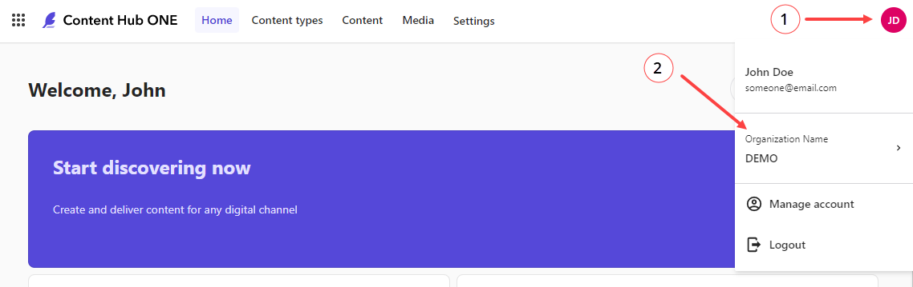
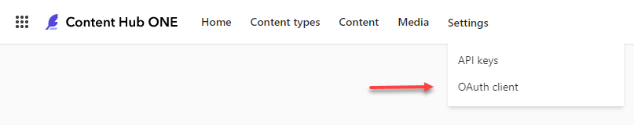

# Content Hub ONE examples 
This repository contains various examples using Content Hub One.

## Hello World examples :wave:
The Hello World examples show how you can use different frameworks combined with Content Hub ONE.

To install the sample data you'll need an active Content Hub ONE subscription

## Installation :cloud:

### CLI
To use the example data in this repository you need to have the Content Hub ONE CLI installed. The ch-one-cli is built using .NET 6 and OS compatibility is determined by the .NET runtime. Verify that your operating system is [supported](https://github.com/dotnet/core/blob/main/release-notes/6.0/supported-os.md) before you start.

Supported OS at this time are:
- Windows
- Linux/MacOS
- Docker

### Installation

Using Chocolatey
```
choco install Sitecore.ContentHubOne.Cli --source https://nuget.sitecore.com/resources/v2/
```

Using Brew
```
brew tap sitecore/content-hub
brew install ch-one-cli
```
:bulb:  For more information and additional installation methods please check out the [documentation](https://doc.sitecore.com/ch-one/en/developers/content-hub-one/content-hub-one-cli.html).

To verify the installation was successful, run the following command:
```
ch-one-cli --version
```

> For manual installation you can find the latest release [here](https://github.com/Sitecore/content-hub-on)

### Using the CLI

:warning: Make sure you have the Content Hub ONE CLI installed. :warning:
  
In order to use the CLI you need to add your own tenant to the CLI configuration. You can do so by running the "tenant add" command:
 
```
ch-one-cli tenant add --organization-id <Organization ID> --tenant-id <Tenant ID> --client-id <OAuth client ID> --client-secret <OAuth client secret>```
```
This command includes the following parameters:

- **organization-id** is the ID of the organization that the tenant is part of.
- **tenant-id** is the ID of the tenant.
- **client-id** is the OAuth client ID that you want to use for the authentication flow.
- **client-secret** is the client secret for the specified OAuth client.

The first two id's can be retrieved from the 'user account menu' at the top right side in the Content Hub ONE application. Click the Organization name to show organization and tenant details.



The client id and client secret can be found using the main navigation. Under the settings option you find the OAuth client menu option.



Once you ran the 'tenant add' command you should be able to use the CLI.

#### Serializing content
The CLI uses a pluggable architecture which means that different commands use different plugins. In order to add serialized content we will be using the serialization (or ser) command.

Go to the serialization folder ({example}/serialization) and run this command:
```
ch-one-cli serialization push content-type --id "SampleArticle"
```
This will create (or update) the content type within your Content Hub ONE instance.

Next we want to create the example content items. We can do so by running this command:
```
ch-one-cli serialization push content-item --content-type "SampleArticle" --id "*"
```

For more information on serialization and all available command please visit the [documentation site](https://doc.sitecore.com/ch-one/en/developers/content-hub-one/content-hub-one-cli--serialization.html)


### Documentation
For more information on Content Hub ONE please visit the [documentation](https://doc.sitecore.com/ch-one) site.

### Bug reports

You can use GitHub to submit [bug reports](https://github.com/Sitecore/contenthubone-examples/issues/new).

### Feature requests

You can use GitHub to submit [feature requests](https://github.com/Sitecore/contenthubone-examples/issues/new).

### Contribute

Contributions are always welcome by submitting [pull requests](https://github.com/Sitecore/contenthubone-examples/pulls) on GitHub!
